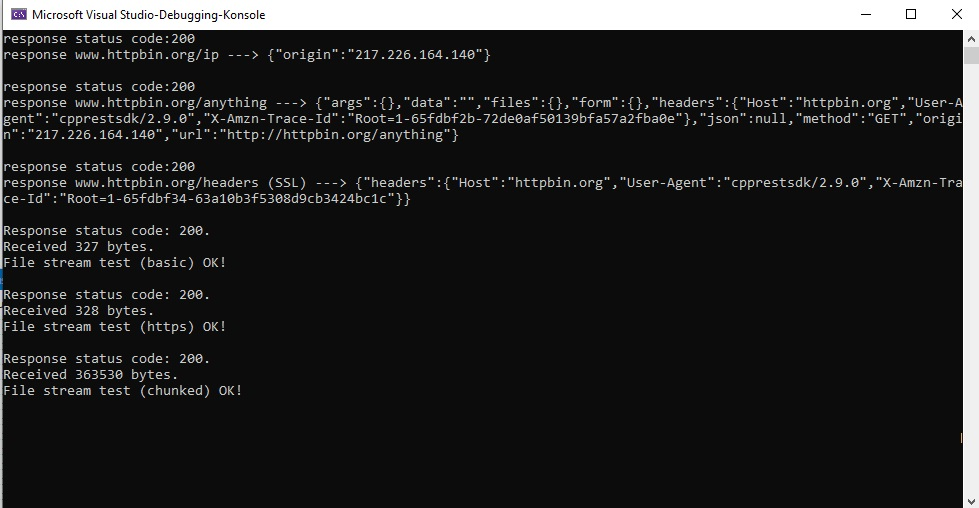

# arestcli

arestcli (i.e. Asio REST Client) is a C++ REST client using (non-boost) *Asio* library underneath.

This is a C++20 port of Microsoft's old REST-SDK (aka Casablanca) using *Asio* library instead of *Boost.Asio*, and also forcing the usage of *Asio* on Windows.

It was created because Boost.BEAST is quite unwieldy (and because it needs the whole of boost!!!).



## WIP: 
 - Only some tests on Windows done 
 - compression disabled and not yet tested (but SSL + websockets workingi!)
 - Only a VisualStudio 2022 solution provided!!! An only working for Debug build, to boot. :-(

## Plans: 
 - Currently a proprietary continuations library by Microsoft is used. I will try to remove this and use C++20 coroutines support in*Asio* instead.
 - The *std::wstring* is used in the API at the moment. This is irritating, will try to switch to narrow strings (it's UTF8 everywhere, innnit?)

## Usage:

```cpp
#include <http_client.h>
#include <cpprest/json.h>

using namespace web;
using namespace web::http;
using namespace web::json;

int main()
{
    http::client::http_client clientRestTest(U("http://httpbin.org"));
    web::json::value client_resp;

    try
    {
        auto response = clientRestTest.request(methods::GET, U("/anything")).get();
        
        if (response.status_code() == status_codes::OK)
            client_resp = response.extract_json().get();
        else
            client_resp = web::json::value();

        std::cout << "response status code:" << response.status_code() << "\n";

        std::wstring respStrg = client_resp.serialize();
        std::string s2(respStrg.begin(), respStrg.end());
        std::cout << " -- response:" << s2 << "\n\n";
    }
    catch (web::http::http_exception& exc)
    {
        std::cout << "exc=" << exc.what() << std::endl;
    }
    catch (web::json::json_exception& exc)
    {
        std::cout << "exc=" << exc.what() << std::endl;
    }
    catch (...)
    {
        std::cout << "unknown exc!!!" << std::endl;
    }
}
```

## Websockets:

```cpp
#include <ws_client.h>

using namespace web;
using namespace web::websockets;
using namespace web::websockets::client;


int main()
{
    try
    {
        websockets::client::websocket_client wsClient();
        wsClient.connect(U("ws://localhost:8080")).get(); 

        websocket_outgoing_message msg;
        msg.set_utf8_message("Hello from client!");

        wsClient.send(msg).get();
        auto response = wsClient.receive().get();
    
        wsClient.close().get();
    }
    catch (websocket_exception& exc)
    {
        std::cout << "exc=" << exc.error_code() << ", txt=" << exc.what() << std::endl;
    }
}
```

## Notes:
 - the example VisualStudio project expects *Asio* (just *Asio*, not *Boost.Asio*!!!) to be installed in ../asio-1.28.0 (header-only, OPEN TODO::: automate it!)
 - also *OpenSSL* has to be installed - disable SLL support with CPPREST_EXCLUDE_SSL if you don't have it

### Build options:

 - CPPREST_EXCLUDE_SSL
 - CPPREST_EXCLUDE_WEBSOCKETS
 - CPPREST_EXCLUDE_COMPRESSION

 - CPPREST_WEBSOCKETPP_DEBUG : enable *websocketpp*'s debug traces (otherwise ther are compiled out and cannot be switched on)
 
